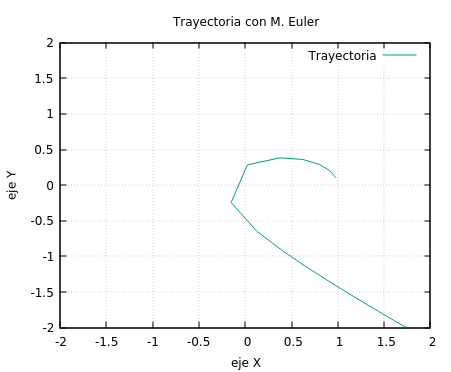

# Tarea 01 - TOPICOS II

--------------------------------------------

##Indice

[ Objetivos ](#id-obj)

1. [Caso 1: y0[ 2 ] = 0.5 ](#id1)
	* [Método Euler](#id1-euler)
	* [Método RK2](#id1-rk2)
	* [Método RK4](#id1-rk4)
	* [Método Leapfrog](#id1-lf)
	* [Comparando métodos - trayectorias](#id1-comp)
	* [Comparando metodos - errores](#id1-conc)

2. [Caso 2: y0[ 2 ] = 1.0](#id2)
	* [Método Euler](#id2-euler)
	* [Método RK2](#id2-rk2)
	* [Método RK4](#id2-rk4)
	* [Método Leapfrog](#id2-lf)
	* [Comparando métodos - trayectorias](#id2-comp)
	* [Comparando métodos - errores](#id2-conc)

3. [Caso 3: y0[ 3 ] = 0.0](#id3)
	* [Método Euler](#id3-euler)
	* [Método RK2](#id3-rk2)
	* [Método RK4](#id3-rk4)
	* [Método Leapfrog](#id3-lf)
	* [Comparando métodos - trayectorias](#id3-comp)
	* [Comparando métodos - errores](#id3-conc)

4. [Caso 4: y0[ 3 ] = 0.5](#id4)
	* [Método Euler](#id4-euler)
	* [Método RK2](#id4-rk2)
	* [Método RK4](#id4-rk4)
	* [Método Leapfrog](#id4-lf)
	* [Comparando métodos - trayectorias](#id4-comp)
	* [Comparando métodos - errores](#id4-conc)

5. [Caso 5: y0[ 4 ] = 0.5](#id5)
	* [Método Euler](#id5-euler)
	* [Método RK2](#id5-rk2)
	* [Método RK4](#id5-rk4)
	* [Método Leapfrog](#id5-lf)
	* [Comparando métodos - trayectorias](#id5-comp)
	* [Comparando métodos - errores](#id5-conc)

6. [Caso 6: y0[ 4 ] = 1.05](#id6)
	* [Método Euler](#id6-euler)
	* [Método RK2](#id6-rk2)
	* [Método RK4](#id6-rk4)
	* [Método Leapfrog](#id6-lf)
	* [Comparando métodos - trayectorias](#id6-comp)
	* [Comparando métodos - errores](#id6-conc)

7. [Conclusiones](#id7-conclusiones)

-------------------------------------------------------------------

## ***Objetivos***

* analizar que metodo es mejor en cada caso y porque?

****************************************************
Luego de modificar las condiciones iniciales de **y0** obtenemos distintos casos para analizar.
**********************

## **1. Caso 1: y0[ 2 ] = 0.5 **

### ***Método Euler*** 

A continuación se observa la trayectoria de un cuerpo con el método euler

A continuación se observa la gráfica: **Error vs tiempo** con el método **euler**.

| zoom ejeX[0;2] ejeY[-2;0] | Error - Euler |
|--------|--------|
|||

Para generar las gráficas se uso **gnuplot**
Codigo:
~~~

// Para la imagen de la trayectoria
set xlabel "eje X"
set ylabel "eje Y"
set xrange [-5:5]
set yrange [-5:5]
set grid xtics
set grid ytics
set title "Trayectoria con M. Euler"
do for[i=0:475]{
	plot 'data.txt' every ::0::i u 2:3 w l title "trayectoria", 'data.txt' every ::i::i u 2:3 w p pt 7 title sprintf ("t = %f",i*(0.21)+0.2)}

// Para el zoom
set xrange [0:2]
set yrange [-2:0]
set xlabel "eje X"}
set ylabel "eje Y"
set grid xtics
set grid ytics
set title "Trayectoria con M. Euler"
plot 'data.txt' u 2:3 w l ls 2 title "Trayectoria"

// Para el error
set title "Error VS Tiempo"
set xlabel "Tiempo"
set ylabel "Error deEuler"
set grid xtics
set grid ytics
plot 'data.txt' u 1:4 w l ls 2 title "Error(t)"

~~~

### ***Método RK2*** 

A continuación se observa la trayectoria de un cuerpo con el método RK2

A continuación se observa la gráfica: **Error vs tiempo** con el método **RK2**.

| zoom ejeX[0.8;0.9] ejeY[1.1;1.2] | Error - RK2 |
|--------|--------|
|||

Para generar las gráficas se uso **gnuplot**
Codigo:
~~~
// Para la imagen de la trayectoria
set xlabel "eje X"
set ylabel "eje Y"
set xrange [-3:3]
set yrange [-3:3]
set grid xtics
set grid ytics
set title "Trayectoria con M. RK2"
do for[i=0:475]{
	plot 'data.txt' every ::0::i u 5:6 w l title "trayectoria", 'data.txt' every ::i::i u 5:6 w p pt 7 title sprintf ("t = %f",i*(0.21)+0.2)}

// Para el zoom
set xrange [0.8:0.9]
set yrange [1.1:1.2]
set xlabel "eje X"}
set ylabel "eje Y"
set grid xtics
set grid ytics
set title "Trayectoria con M. RK2"
plot 'data.txt' u 5:6 w l ls 2 title "Trayectoria"

    
// Para el error
set title "Error VS Tiempo"
set xlabel "Tiempo"
set ylabel "Error de RK2"
set grid xtics
set grid ytics
plot 'data.txt' u 1:7 w l ls 2 title "Error(t)"
~~~

### ***Método RK4*** 

A continuación se observa la trayectoria de un cuerpo con el método RK4

A continuación se observa la gráfica: **Error vs tiempo** con el método **RK4**.

| zoom ejeX[0.4;0.6] ejeY[-0.6;-0.4] | Error - RK4 |
|--------|--------|
|||

Para generar las gráficas se uso **gnuplot**
Codigo:
~~~
// Para la imagen de la trayectoria
set xlabel "eje X"
set ylabel "eje Y"
set xrange [-2.5:2.5]
set yrange [-2.5:2.5]
set grid xtics
set grid ytics
set title "Trayectoria con M. RK4"
do for[i=0:475]{
	plot 'data.txt' every ::0::i u 8:9 w l title "trayectoria", 'data.txt' every ::i::i u 8:9 w p pt 7 title sprintf ("t = %f",i*(0.21)+0.2)}

// Para el zoom
set xrange [0.4:0.6]
set yrange [-0.6:-0.4]
set xlabel "eje X"
set ylabel "eje Y"
set grid xtics
set grid ytics
set title "Trayectoria con M. RK4"
plot 'data.txt' u 8:9 w l ls 2 title "Trayectoria"

    
// Para el error
set title "Error VS Tiempo"
set xlabel "Tiempo"
set ylabel "Error de RK4"
set grid xtics
set grid ytics
plot 'data.txt' u 1:10 w l ls 2 title "Error(t)"
~~~

### ***Método Leapfrog***

A continuación se observa la trayectoria de un cuerpo con el método Leapfrog.

A continuación se observa la gráfica: **Error vs tiempo** con el método **Leapfrog**.

| zoom ejeX[0.4;0.6] ejeY[-0.6;-0.4] | Error - Leapfrog |
|--------|--------|
|||

Para generar las gráficas se uso **gnuplot**
Codigo:
~~~
// Para la imagen de la trayectoria
set xlabel "eje X"
set ylabel "eje Y"
set xrange [-2.5:2.5]
set yrange [-2.5:2.5]
set grid xtics
set grid ytics
set title "Trayectoria con M. Leapfrog"
do for[i=0:475]{
	plot 'data.txt' every ::0::i u 11:12 w l title "trayectoria", 'data.txt' every ::i::i u 11:12 w p pt 7 title sprintf ("t = %f",i*(0.21)+0.2)}

// Para el zoom
set xrange [0.4:0.6]
set yrange [-0.6:-0.4]
set xlabel "eje X"
set ylabel "eje Y"
set grid xtics
set grid ytics
set title "Trayectoria con M. Leapfrog"
plot 'data.txt' u 11:12 w l ls 2 title "Trayectoria"

    
// Para el error
set title "Error VS Tiempo"
set xlabel "Tiempo"
set ylabel "Error de Leapfrog"
set grid xtics
set grid ytics
plot 'data.txt' u 1:13 w l ls 2 title "Error(t)"
~~~

### ***CComparando métodos - trayectorias***

Comparando los 4 métodos estudiados:

| comparacion de trayectorias | zoom |
|---------------------------------------------------------------------------|-------------------------------------------------------------------------|
|  |  |

De las imagenes anteriores se observa un método con menor precision y es el método de euler, observando a los demás métodos mucho más precisos, pero con sus respectivos errores y con trayectorias muy cercanas.

### ***Comparando métodos - errores***

| Comparando errores | zoom de errores mínimos |
|--------|--------|
|||

Luego de observar el gráfico anterior, podemos observar que el error del **método de euler** es muy elevado en comparación con los démas métodos, luego de tener un acercamiento a la gráfica, podemos observar tambien que los otros métodos tienen un error muy pequeño, resaltando el método **RK4** con errores de orden $10^{-10}$, pero que aumenta con el tiempo en menor escala que los demas

El método con menos errores y más preciso es el [**método RK4**](#id1-rk4)

-------------------------------------------------

## **2. Caso 2: y0[ 2 ] = 1.0 **

### ***Método Euler*** 

A continuación se observa la trayectoria de un cuerpo con el método euler

A continuación se observa la gráfica: **Error vs tiempo** con el método **euler**.

| zoom de trayectoria | Error - Euler |
|--------|--------|
|||

Para generar las gráficas se uso **gnuplot**
Codigo:
~~~
// Para la imagen de la trayectoria
set xlabel "eje X"
set ylabel "eje Y"
set xrange [-9:9]
set yrange [-9:9]
set grid xtics
set grid ytics
set title "Trayectoria con M. Euler"
do for[i=0:475]{
	plot 'data.txt' every ::0::i u 2:3 w l title "trayectoria", 'data.txt' every ::i::i u 2:3 w p pt 7 title sprintf ("t = %f",i*(0.21)+0.2)}

// Para el zoom
set xrange [0:2]
set yrange [2:4]
set xlabel "eje X"
set ylabel "eje Y"
set grid xtics
set grid ytics
set title "Trayectoria con M. Euler"
plot 'data.txt' u 2:3 w l ls 2 title "Trayectoria"

// Para el error
set title "Error VS Tiempo"
set xlabel "Tiempo"
set ylabel "Error deEuler"
set grid xtics
set grid ytics
plot 'data.txt' u 1:4 w l ls 2 title "Error(t)"
~~~

### ***Método RK2***

A continuación se observa la trayectoria de un cuerpo con el método RK2

A continuación se observa la gráfica: **Error vs tiempo** con el método **RK2**.

| zoom de trayectoria | Error - RK2 |
|--------|--------|
|||

Para generar las gráficas se uso **gnuplot**
Codigo:
~~~
// Para la imagen de la trayectoria
set xlabel "eje X"
set ylabel "eje Y"
set xrange [-5.5:5.5]
set yrange [-5.5:5.5]
set grid xtics
set grid ytics
set title "Trayectoria con M. RK2"
do for[i=0:475]{
	plot 'data.txt' every ::0::i u 5:6 w l title "trayectoria", 'data.txt' every ::i::i u 5:6 w p pt 7 title sprintf ("t = %f",i*(0.21)+0.2)}

// Para el zoom
set xrange [0.9:1.0]
set yrange [1.4:1.5]
set xlabel "eje X"
set ylabel "eje Y"
set grid xtics
set grid ytics
set title "Trayectoria con M. RK2"
plot 'data.txt' u 5:6 w l ls 2 title "Trayectoria"

    
// Para el error
set title "Error VS Tiempo"
set xlabel "Tiempo"
set ylabel "Error de RK2"
set grid xtics
set grid ytics
plot 'data.txt' u 1:7 w l ls 2 title "Error(t)"
~~~

### ***Método RK4*** 

A continuación se observa la trayectoria de un cuerpo con el método RK4

A continuación se observa la gráfica: **Error vs tiempo** con el método **RK4**.

| zoom de trayectoria | Error - RK4 |
|--------|--------|
|||

Para generar las gráficas se uso **gnuplot**
Codigo:
~~~
// Para la imagen de la trayectoria
set xlabel "eje X"
set ylabel "eje Y"
set xrange [-5.5:5.5]
set yrange [-5.5:5.5]
set grid xtics
set grid ytics
set title "Trayectoria con M. RK4"
do for[i=0:475]{
	plot 'data.txt' every ::0::i u 8:9 w l title "trayectoria", 'data.txt' every ::i::i u 8:9 w p pt 7 title sprintf ("t = %f",i*(0.21)+0.2)}

// Para el zoom
set xrange [0.7:0.9]
set yrange [0:0.2]
set xlabel "eje X"
set ylabel "eje Y"
set grid xtics
set grid ytics
set title "Trayectoria con M. RK4"
plot 'data.txt' u 8:9 w l ls 2 title "Trayectoria"

// Para el error
set title "Error VS Tiempo"
set xlabel "Tiempo"
set ylabel "Error de RK4"
set grid xtics
set grid ytics
plot 'data.txt' u 1:10 w l ls 2 title "Error(t)"
~~~

### ***Método Leapfrog***

A continuación se observa la trayectoria de un cuerpo con el método Leapfrog.

A continuación se observa la gráfica: **Error vs tiempo** con el método **Leapfrog**.

| zoom de trayectoria | Error - Leapfrog |
|--------|--------|
|||

Para generar las gráficas se uso **gnuplot**
Codigo:
~~~
// Para la imagen de la trayectoria
set xlabel "eje X"
set ylabel "eje Y"
set xrange [-5.5:5.5]
set yrange [-5.5:5.5]
set grid xtics
set grid ytics
set title "Trayectoria con M. Leapfrog"
do for[i=0:475]{
	plot 'data.txt' every ::0::i u 11:12 w l title "trayectoria", 'data.txt' every ::i::i u 11:12 w p pt 7 title sprintf ("t = %f",i*(0.21)+0.2)}

// Para el zoom
set xrange [0.34:0.44]
set yrange [-0.5:-0.4]
set xlabel "eje X"
set ylabel "eje Y"
set grid xtics
set grid ytics
set title "Trayectoria con M. Leapfrog"
plot 'data.txt' u 11:12 w l ls 2 title "Trayectoria"

    
// Para el error
set title "Error VS Tiempo"
set xlabel "Tiempo"
set ylabel "Error de Leapfrog"
set grid xtics
set grid ytics
plot 'data.txt' u 1:13 w l ls 2 title "Error(t)"
~~~

### ***Comparando métodos - trayectorias***

Comparando los 4 métodos estudiados:

| comparacion de trayectorias | zoom |
|--------|--------|
|||

De las imagenes anteriores se observa un método con menor precision y es el método de **euler**, observando a los demás métodos mucho más precisos, pero con sus respectivos errores y con trayectorias muy cercanas

### ***Comparando métodos - errores***

| Comparando errores | zoom de errores mínimos |
|--------|--------|
|||

Luego de observar el gráfico anterior, podemos observar que el error del método de euler es muy elevado en comparación con los démas métodos, pero luego de tener un acercamiento a la gráfica, podemos observar tambien que los otros métodos tienes un error muy pequeño resaltando el método **RK4** con errores de orden $10^{-9}$, pero que aumenta con el tiempo en menor escala que los demás, casis imperceptibles.

El método con menos errores y más preciso es el [**método RK4**](#id2-rk4)

-----------------------------------------------------------------------

## **3. Caso 3: y0[ 3 ] = 0.0 **

### ***Método Euler*** 

A continuación se observa la trayectoria de un cuerpo con el método euler

A continuación se observa la gráfica: **Error vs tiempo** con el método **euler**.

| zoom de trayectoria | Error - Euler |
|--------|--------|
|||

Para generar las gráficas se uso **gnuplot**
Codigo:
~~~
// Para la imagen de la trayectoria
set xlabel "eje X"
set ylabel "eje Y"
set xrange [-2.5:2.5]
set yrange [-2.5:2.5]
set grid xtics
set grid ytics
set title "Trayectoria con M. Euler"
do for[i=0:475]{
	plot 'data.txt' every ::0::i u 2:3 w l title "trayectoria", 'data.txt' every ::i::i u 2:3 w p pt 7 title sprintf ("t = %f",i*(0.21)+0.2)}

// Para el zoom
set xrange [0.5:1.5]
set yrange [-1.5:-0.5]
set xlabel "eje X"
set ylabel "eje Y"
set grid xtics
set grid ytics
set title "Trayectoria con M. Euler"
plot 'data.txt' u 2:3 w l ls 2 title "Trayectoria"

// Para el error
set title "Error VS Tiempo"
set xlabel "Tiempo"
set ylabel "Error deEuler"
set grid xtics
set grid ytics
plot 'data.txt' u 1:4 w l ls 2 title "Error(t)"
~~~

### ***Método RK2***

A continuación se observa la trayectoria de un cuerpo con el método RK2

A continuación se observa la gráfica: **Error vs tiempo** con el método **RK2**.

| zoom de trayectoria | Error - RK2 |
|--------|--------|
|||

Para generar las gráficas se uso **gnuplot**
Codigo:
~~~
// Para la imagen de la trayectoria
set xlabel "eje X"
set ylabel "eje Y"
set xrange [-1.5:1.5]
set yrange [-1.5:1.5]
set grid xtics
set grid ytics
set title "Trayectoria con M. RK2"
do for[i=0:475]{
	plot 'data.txt' every ::0::i u 5:6 w l title "trayectoria", 'data.txt' every ::i::i u 5:6 w p pt 7 title sprintf ("t = %f",i*(0.21)+0.2)}

// Para el zoom
set xrange [0.7:0.8]
set yrange [-0.8:-0.7]
set xlabel "eje X"
set ylabel "eje Y"
set grid xtics
set grid ytics
set title "Trayectoria con M. RK2"
plot 'data.txt' u 5:6 w l ls 2 title "Trayectoria"

    
// Para el error
set title "Error VS Tiempo"
set xlabel "Tiempo"
set ylabel "Error de RK2"
set grid xtics
set grid ytics
plot 'data.txt' u 1:7 w l ls 2 title "Error(t)"
~~~

### ***Método RK4*** 

A continuación se observa la trayectoria de un cuerpo con el método RK4

A continuación se observa la gráfica: **Error vs tiempo** con el método **RK4**.

| zoom de trayectoria | Error - RK4 |
|--------|--------|
|||

Para generar las gráficas se uso **gnuplot**
Codigo:
~~~
// Para la imagen de la trayectoria
set xlabel "eje X"
set ylabel "eje Y"
set xrange [-1.5:1.5]
set yrange [-1.5:1.5]
set grid xtics
set grid ytics
set title "Trayectoria con M. RK4"
do for[i=0:475]{
	plot 'data.txt' every ::0::i u 8:9 w l title "trayectoria", 'data.txt' every ::i::i u 8:9 w p pt 7 title sprintf ("t = %f",i*(0.21)+0.2)}

// Para el zoom
set xrange [0.9:1.1]
set yrange [0:0.2]
set xlabel "eje X"
set ylabel "eje Y"
set grid xtics
set grid ytics
set title "Trayectoria con M. RK4"
plot 'data.txt' u 8:9 w l ls 2 title "Trayectoria"

// Para el error
set title "Error VS Tiempo"
set xlabel "Tiempo"
set ylabel "Error de RK4"
set grid xtics
set grid ytics
plot 'data.txt' u 1:10 w l ls 2 title "Error(t)"
~~~

### ***Método Leapfrog***

A continuación se observa la trayectoria de un cuerpo con el método Leapfrog.

A continuación se observa la gráfica: **Error vs tiempo** con el método **Leapfrog**.

| zoom de trayectoria | Error - Leapfrog |
|--------|--------|
|||

Para generar las gráficas se uso **gnuplot**
Codigo:
~~~
//Para la imagen de la trayectoria
set xlabel "eje X"
set ylabel "eje Y"
set xrange [-1.5:1.5]
set yrange [-1.5:1.5]
set grid xtics
set grid ytics
set title "Trayectoria con M. Leapfrog"
do for[i=0:475]{
	plot 'data.txt' every ::0::i u 11:12 w l title "trayectoria", 'data.txt' every ::i::i u 11:12 w p pt 7 title sprintf ("t = %f",i*(0.21)+0.2)}

// Para el zoom
set xrange [0.9:1.1]
set yrange [0:0.2]
set xlabel "eje X"
set ylabel "eje Y"
set grid xtics
set grid ytics
set title "Trayectoria con M. Leapfrog"
plot 'data.txt' u 11:12 w l ls 2 title "Trayectoria"

    
// Para el error
set title "Error VS Tiempo"
set xlabel "Tiempo"
set ylabel "Error de Leapfrog"
set grid xtics
set grid ytics
plot 'data.txt' u 1:13 w l ls 2 title "Error(t)"
~~~

### ***Comparando métodos - trayectorias***

Comparando los 4 métodos estudiados:

| comparacion de trayectorias | zoom |
|--------|--------|
|||

De las imagenes anteriores se observa un método con menor precision y es el método de **euler**, donde el método de euler muestra como nuestro cuerpo se va alejando, al parecer producto de la acumulacion de errores en el calculo de su trayectoria, sin embargo observamos a los demás métodos mucho más precisos, pero con sus respectivos errores y con trayectorias muy cercanas.

### ***Comparando métodos - errores***

| Comparando errores | zoom de errores mínimos |
|--------|--------|
|||

Luego de observar el gráfico anterior, podemos observar que el error del método de euler es muy elevado en comparación con los démas métodos, mostrando un curva casi logaritmica pero muy elevada, además luego de tener un acercamiento a la gráfica, podemos observar tambien que los otros métodos tienes un error muy pequeño resaltando el método **RK4** con errores de orden $10^{-11}$, pero que aumenta con el tiempo en menor escala que los demás, casis imperceptibles, pero casi de manera lineal y constante conforme avanza el tiempo.

El método con menos errores y más preciso es el [**método RK4**](#id3-rk4)

## **4. Caso 4: y0[ 3 ] = 0.5 **

### ***Método Euler*** 

A continuación se observa la trayectoria de un cuerpo con el método euler

A continuación se observa la gráfica: **Error vs tiempo** con el método **euler**.

| zoom de trayectoria | Error - Euler |
|--------|--------|
|||

Para generar las gráficas se uso **gnuplot**
Codigo:
~~~
// Para la imagen de la trayectoria
set xlabel "eje X"
set ylabel "eje Y"
set xrange [-5:5]
set yrange [-5:5]
set grid xtics
set grid ytics
set title "Trayectoria con M. Euler"
do for[i=0:475]{
	plot 'data.txt' every ::0::i u 2:3 w l title "trayectoria", 'data.txt' every ::i::i u 2:3 w p pt 7 title sprintf ("t = %f",i*(0.21)+0.2)}

// Para el zoom
set xrange [0.5:1]
set yrange [-1:-0.5]
set xlabel "eje X"
set ylabel "eje Y"
set grid xtics
set grid ytics
set title "Trayectoria con M. Euler"
plot 'data.txt' u 2:3 w l ls 2 title "Trayectoria"

// Para el error
set title "Error VS Tiempo"
set xlabel "Tiempo"
set ylabel "Error deEuler"
set grid xtics
set grid ytics
plot 'data.txt' u 1:4 w l ls 2 title "Error(t)"
~~~

### ***Método RK2***

A continuación se observa la trayectoria de un cuerpo con el método RK2

A continuación se observa la gráfica: **Error vs tiempo** con el método **RK2**.

| zoom de trayectoria | Error - RK2 |
|--------|--------|
|||

Para generar las gráficas se uso **gnuplot**
Codigo:
~~~
// Para la imagen de la trayectoria
set xlabel "eje X"
set ylabel "eje Y"
set xrange [-2.5:2.5]
set yrange [-2.5:2.5]
set grid xtics
set grid ytics
set title "Trayectoria con M. RK2"
do for[i=0:475]{
	plot 'data.txt' every ::0::i u 5:6 w l title "trayectoria", 'data.txt' every ::i::i u 5:6 w p pt 7 title sprintf ("t = %f",i*(0.21)+0.2)}

// Para el zoom
set xrange [0.9:1.0]
set yrange [-0.1:0]
set xlabel "eje X"
set ylabel "eje Y"
set grid xtics
set grid ytics
set title "Trayectoria con M. RK2"
plot 'data.txt' u 5:6 w l ls 2 title "Trayectoria"

    
// Para el error
set title "Error VS Tiempo"
set xlabel "Tiempo"
set ylabel "Error de RK2"
set grid xtics
set grid ytics
plot 'data.txt' u 1:7 w l ls 2 title "Error(t)"
~~~

### ***Método RK4*** 

A continuación se observa la trayectoria de un cuerpo con el método RK4

A continuación se observa la gráfica: **Error vs tiempo** con el método **RK4**.

| zoom de trayectoria | Error - RK4 |
|--------|--------|
|||

Para generar las gráficas se uso **gnuplot**
Codigo:
~~~
// Para la imagen de la trayectoria
set xlabel "eje X"
set ylabel "eje Y"
set xrange [-2.5:2.5]
set yrange [-2.5:2.5]
set grid xtics
set grid ytics
set title "Trayectoria con M. RK4"
do for[i=0:475]{
	plot 'data.txt' every ::0::i u 8:9 w l title "trayectoria", 'data.txt' every ::i::i u 8:9 w p pt 7 title sprintf ("t = %f",i*(0.21)+0.2)}

// Para el zoom
set xrange [1:1.1]
set yrange [0:0.1]
set xlabel "eje X"
set ylabel "eje Y"
set grid xtics
set grid ytics
set title "Trayectoria con M. RK4"
plot 'data.txt' u 8:9 w l ls 2 title "Trayectoria"

// Para el error
set title "Error VS Tiempo"
set xlabel "Tiempo"
set ylabel "Error de RK4"
set grid xtics
set grid ytics
plot 'data.txt' u 1:10 w l ls 2 title "Error(t)"
~~~

### ***Método Leapfrog***

A continuación se observa la trayectoria de un cuerpo con el método Leapfrog.

A continuación se observa la gráfica: **Error vs tiempo** con el método **Leapfrog**.

| zoom de trayectoria | Error - Leapfrog |
|--------|--------|
|||

Para generar las gráficas se uso **gnuplot**
Codigo:
~~~
// Para la imagen de la trayectoria
set xlabel "eje X"
set ylabel "eje Y"
set xrange [-2.5:2.5]
set yrange [-2.5:2.5]
set grid xtics
set grid ytics
set title "Trayectoria con M. Leapfrog"
do for[i=0:475]{
	plot 'data.txt' every ::0::i u 11:12 w l title "trayectoria", 'data.txt' every ::i::i u 11:12 w p pt 7 title sprintf ("t = %f",i*(0.21)+0.2)}

// Para el zoom
set xrange [0.9:1]
set yrange [-0.1:0]
set xlabel "eje X"
set ylabel "eje Y"
set grid xtics
set grid ytics
set title "Trayectoria con M. Leapfrog"
plot 'data.txt' u 11:12 w l ls 2 title "Trayectoria"

    
// Para el error
set title "Error VS Tiempo"
set xlabel "Tiempo"
set ylabel "Error de Leapfrog"
set grid xtics
set grid ytics
plot 'data.txt' u 1:13 w l ls 2 title "Error(t)"
~~~

### ***Comparando métodos - trayectorias***

Comparando los 4 métodos estudiados:

| comparacion de trayectorias | zoom |
|--------|--------|
|||

De las imagenes anteriores se observa un método con menor precision y es el método de **euler**, donde el método de euler muestra como nuestro cuerpo se va alejando, al parecer producto de la acumulacion de errores en el calculo de su trayectoria, sin embargo observamos a los demás métodos mucho más precisos, pero con sus respectivos errores y con trayectorias muy cercanas.

### ***Comparando métodos - errores***

| Comparando errores | zoom de errores mínimos |
|--------|--------|
|||

Luego de observar el gráfico anterior, podemos observar que el error del método de euler es muy elevado en comparación con los démas métodos, mostrando un curva casi logaritmica pero muy elevada, además luego de tener un acercamiento a la gráfica, podemos observar tambien que los otros métodos tienes un error muy pequeño resaltando el método **RK4** con errores de orden $10^{-11}$, pero que aumenta con el tiempo en menor escala que los demás, casis imperceptibles, pero casi de manera lineal y constante conforme avanza el tiempo.

El método con menos errores y más preciso es el [**método RK4**](#id4-rk4)

## **5. Caso 5: y0[ 4 ] = 0.5 **

### ***Método Euler*** 

A continuación se observa la trayectoria de un cuerpo con el método euler

A continuación se observa la gráfica: **Error vs tiempo** con el método **euler**.

| zoom de trayectoria | Error - Euler |
|--------|--------|
|||

Para generar las gráficas se uso **gnuplot**
Codigo:
~~~
// Para la imagen de la trayectoria
set xlabel "eje X"
set ylabel "eje Y"
set xrange [-1:20]
set yrange [-20:1]
set grid xtics
set grid ytics
set title "Trayectoria con M. Euler"
do for[i=0:475]{
	plot 'data.txt' every ::0::i u 2:3 w l title "trayectoria", 'data.txt' every ::i::i u 2:3 w p pt 7 title sprintf ("t = %f",i*(0.21)+0.2)}

// Para el zoom
set xrange [-2:2]
set yrange [-2:2]
set xlabel "eje X"
set ylabel "eje Y"
set grid xtics
set grid ytics
set title "Trayectoria con M. Euler"
plot 'data.txt' u 2:3 w l ls 2 title "Trayectoria"

// Para el error
set title "Error VS Tiempo"
set xlabel "Tiempo"
set ylabel "Error deEuler"
set grid xtics
set grid ytics
plot 'data.txt' u 1:4 w l ls 2 title "Error(t)"
~~~

### ***Método RK2***

A continuación se observa la trayectoria de un cuerpo con el método RK2

A continuación se observa la gráfica: **Error vs tiempo** con el método **RK2**.

| zoom de trayectoria | Error - RK2 |
|--------|--------|
|||

Para generar las gráficas se uso **gnuplot**
Codigo:
~~~
// Para la imagen de la trayectoria
set xlabel "eje X"
set ylabel "eje Y"
set xrange [-2:2]
set yrange [-2:2]
set grid xtics
set grid ytics
set title "Trayectoria con M. RK2"
do for[i=0:475]{
	plot 'data.txt' every ::0::i u 5:6 w l title "trayectoria", 'data.txt' every ::i::i u 5:6 w p pt 7 title sprintf ("t = %f",i*(0.21)+0.2)}

// Para el zoom
set xrange [-0.5:0.5]
set yrange [-1:0]
set xlabel "eje X"
set ylabel "eje Y"
set grid xtics
set grid ytics
set title "Trayectoria con M. RK2"
plot 'data.txt' u 5:6 w l ls 2 title "Trayectoria"

    
// Para el error
set title "Error VS Tiempo"
set xlabel "Tiempo"
set ylabel "Error de RK2"
set grid xtics
set grid ytics
plot 'data.txt' u 1:7 w l ls 2 title "Error(t)"
~~~

### ***Método RK4*** 

A continuación se observa la trayectoria de un cuerpo con el método RK4

A continuación se observa la gráfica: **Error vs tiempo** con el método **RK4**.

| zoom de trayectoria | Error - RK4 |
|--------|--------|
|||

Para generar las gráficas se uso **gnuplot**
Codigo:
~~~
// Para la imagen de la trayectoria
set xlabel "eje X"
set ylabel "eje Y"
set xrange [-1.5:1.5]
set yrange [-1.5:1.5]
set grid xtics
set grid ytics
set title "Trayectoria con M. RK4"
do for[i=0:475]{
	plot 'data.txt' every ::0::i u 8:9 w l title "trayectoria", 'data.txt' every ::i::i u 8:9 w p pt 7 title sprintf ("t = %f",i*(0.21)+0.2)}

// Para el zoom
set xrange [0.9:1]
set yrange [-0.2:-0.1]
set xlabel "eje X"
set ylabel "eje Y"
set grid xtics
set grid ytics
set title "Trayectoria con M. RK4"
plot 'data.txt' u 8:9 w l ls 2 title "Trayectoria"

// Para el error
set title "Error VS Tiempo"
set xlabel "Tiempo"
set ylabel "Error de RK4"
set grid xtics
set grid ytics
plot 'data.txt' u 1:10 w l ls 2 title "Error(t)"
~~~

### ***Método Leapfrog***

A continuación se observa la trayectoria de un cuerpo con el método Leapfrog.

A continuación se observa la gráfica: **Error vs tiempo** con el método **Leapfrog**.

| zoom de trayectoria | Error - Leapfrog |
|--------|--------|
|||

Para generar las gráficas se uso **gnuplot**
Codigo:
~~~
// Para la imagen de la trayectoria
set xlabel "eje X"
set ylabel "eje Y"
set xrange [-1:1]
set yrange [-1:1]
set grid xtics
set grid ytics
set title "Trayectoria con M. Leapfrog"
do for[i=0:475]{
	plot 'data.txt' every ::0::i u 11:12 w l title "trayectoria", 'data.txt' every ::i::i u 11:12 w p pt 7 title sprintf ("t = %f",i*(0.21)+0.2)}

// Para el zoom
set xrange [-0.15:0.15]
set yrange [-0.15:0.15]
set xlabel "eje X"
set ylabel "eje Y"
set grid xtics
set grid ytics
set title "Trayectoria con M. Leapfrog"
plot 'data.txt' u 11:12 w l ls 2 title "Trayectoria"

    
// Para el error
set title "Error VS Tiempo"
set xlabel "Tiempo"
set ylabel "Error de Leapfrog"
set grid xtics
set grid ytics
plot 'data.txt' u 1:13 w l ls 2 title "Error(t)"
~~~

### ***Comparando métodos - trayectorias***

Comparando los 4 métodos estudiados:

| comparacion de trayectorias | zoom |
|--------|--------|
|||

De las imagenes anteriores se observa un método con menor precision y es el método de **euler**, que indica que nuestro cuerpo se acerca a nuestro cuerpo central y luego se empieza a alejar, al parecer producto de la acumulacion de errores en el calculo de su trayectoria, sin embargo observamos a los demás métodos con un trayectoria similiar pero no iguales, es el caso del método **método de RK2** que parece oberitar alrededor del cuerpo central pero con una orbita cambiando de posicion, luego tenemos el **método leapfrog** y el **método RK4** tienen una trayectoria más parecida

### ***Comparando métodos - errores***

| Comparando errores | zoom de errores mínimos |
|--------|--------|
|||

Luego de observar el gráfico anterior, obervamos 2 métodos con un error considerable y son los métodos de **Euler** y **RK2**, donde el método de euler luego se muy alto ya no parece incrementarse de manera exponencial, y el método RK2 aumenta de manera lineal pero rapidamente conforme avanza el tiempo, luego por ultimo tenemos los método **RK4** y **Leapfrog** con errores casi imperceptibles, pero luego de tener un mayor acercamiento el método RK4 tiende a aumentar de manera lineal en funcion del tiempo a un orden de $10^{-3}$ que es un poco alto a comparacion de casos anteriores que resulto el más eficiente con una menor escala, sin embargo el método **Leapfrog** tiene picos relativamente altos en el orden de $10^{-3}$ sin embargo luego de los picos el error disminuye considerablemente manteniendo un error casi oscilante y predecible para una futura correccion rapida para un ajuste para mayor precision.

El método con menos errores y más preciso es el [**método Leapfrog**](#id5-lp)

## **6. Caso 6: y0[ 4 ] = 1.05 **

### ***Método Euler*** 

A continuación se observa la trayectoria de un cuerpo con el método euler

A continuación se observa la gráfica: **Error vs tiempo** con el método **euler**.

| zoom de trayectoria | Error - Euler |
|--------|--------|
|||

Para generar las gráficas se uso **gnuplot**
Codigo:
~~~
// Para la imagen de la trayectoria
set xlabel "eje X"
set ylabel "eje Y"
set xrange [-2.5:2.5]
set yrange [-2.5:2.5]
set grid xtics
set grid ytics
set title "Trayectoria con M. Euler"
do for[i=0:475]{
	plot 'data.txt' every ::0::i u 2:3 w l title "trayectoria", 'data.txt' every ::i::i u 2:3 w p pt 7 title sprintf ("t = %f",i*(0.21)+0.2)}

// Para el zoom
set xrange [0:1]
set yrange [-2:-1]
set xlabel "eje X"
set ylabel "eje Y"
set grid xtics
set grid ytics
set title "Trayectoria con M. Euler"
plot 'data.txt' u 2:3 w l ls 2 title "Trayectoria"

// Para el error
set title "Error VS Tiempo"
set xlabel "Tiempo"
set ylabel "Error deEuler"
set grid xtics
set grid ytics
plot 'data.txt' u 1:4 w l ls 2 title "Error(t)"
~~~

### ***Método RK2***

A continuación se observa la trayectoria de un cuerpo con el método RK2

A continuación se observa la gráfica: **Error vs tiempo** con el método **RK2**.

| zoom de trayectoria | Error - RK2 |
|--------|--------|
|||

Para generar las gráficas se uso **gnuplot**
Codigo:
~~~
// Para la imagen de la trayectoria
set xlabel "eje X"
set ylabel "eje Y"
set xrange [-1.5:1.5]
set yrange [-1.5:1.5]
set grid xtics
set grid ytics
set title "Trayectoria con M. RK2"
do for[i=0:475]{
	plot 'data.txt' every ::0::i u 5:6 w l title "trayectoria", 'data.txt' every ::i::i u 5:6 w p pt 7 title sprintf ("t = %f",i*(0.21)+0.2)}

// Para el zoom
set xrange [0.8:0.9]
set yrange [-0.6:-0.5]
set xlabel "eje X"
set ylabel "eje Y"
set grid xtics
set grid ytics
set title "Trayectoria con M. RK2"
plot 'data.txt' u 5:6 w l ls 2 title "Trayectoria"

    
// Para el error
set title "Error VS Tiempo"
set xlabel "Tiempo"
set ylabel "Error de RK2"
set grid xtics
set grid ytics
plot 'data.txt' u 1:7 w l ls 2 title "Error(t)"
~~~

### ***Método RK4*** 

A continuación se observa la trayectoria de un cuerpo con el método RK4

A continuación se observa la gráfica: **Error vs tiempo** con el método **RK4**.

| zoom de trayectoria | Error - RK4 |
|--------|--------|
|||

Para generar las gráficas se uso **gnuplot**
Codigo:
~~~
// Para la imagen de la trayectoria
set xlabel "eje X"
set ylabel "eje Y"
set xrange [-1.5:1.5]
set yrange [-1.5:1.5]
set grid xtics
set grid ytics
set title "Trayectoria con M. RK4"
do for[i=0:475]{
	plot 'data.txt' every ::0::i u 8:9 w l title "trayectoria", 'data.txt' every ::i::i u 8:9 w p pt 7 title sprintf ("t = %f",i*(0.21)+0.2)}

// Para el zoom
set xrange [0.9:1]
set yrange [-0.2:-0.1]
set xlabel "eje X"
set ylabel "eje Y"
set grid xtics
set grid ytics
set title "Trayectoria con M. RK4"
plot 'data.txt' u 8:9 w l ls 2 title "Trayectoria"

// Para el error
set title "Error VS Tiempo"
set xlabel "Tiempo"
set ylabel "Error de RK4"
set grid xtics
set grid ytics
plot 'data.txt' u 1:10 w l ls 2 title "Error(t)"
~~~

### ***Método Leapfrog***

A continuación se observa la trayectoria de un cuerpo con el método Leapfrog.

A continuación se observa la gráfica: **Error vs tiempo** con el método **Leapfrog**.

| zoom de trayectoria | Error - Leapfrog |
|--------|--------|
|||

Para generar las gráficas se uso **gnuplot**
Codigo:
~~~
// Para la imagen de la trayectoria
set xlabel "eje X"
set ylabel "eje Y"
set xrange [-1.5:1.5]
set yrange [-1.5:1.5]
set grid xtics
set grid ytics
set title "Trayectoria con M. Leapfrog"
do for[i=0:475]{
	plot 'data.txt' every ::0::i u 11:12 w l title "trayectoria", 'data.txt' every ::i::i u 11:12 w p pt 7 title sprintf ("t = %f",i*(0.21)+0.2)}

// Para el zoom
set xrange [0.7:0.8]
set yrange [-0.8:-0.7]
set xlabel "eje X"
set ylabel "eje Y"
set grid xtics
set grid ytics
set title "Trayectoria con M. Leapfrog"
plot 'data.txt' u 11:12 w l ls 2 title "Trayectoria"

    
// Para el error
set title "Error VS Tiempo"
set xlabel "Tiempo"
set ylabel "Error de Leapfrog"
set grid xtics
set grid ytics
plot 'data.txt' u 1:13 w l ls 2 title "Error(t)"
~~~

### ***Comparando métodos - trayectorias***

Comparando los 4 métodos estudiados:

| comparacion de trayectorias | zoom |
|--------|--------|
|||

De las imagenes anteriores se observa que la trayectoria con el **método de euler** es de un cuerpo alejandose del otro conforme avanza el tiempo de manera aparentemente constante, y con los demas métodos se oberva una gran similitud en la trayectoria y acercandoce más se observa una mayor similitud entre los métodos **RK2** y **Leapfrog** y la treyectoria generada del **método euler** ya se encuentra muy alejada de la trayectoria generada por los otros métodos.

### ***Comparando métodos - errores***

| Comparando errores | zoom de errores mínimos |
|---------------------------------------------------------|------------------------------------------------------------------|
|||

Luego de observar el gráfico anterior, obervamos que el **método de euler** genera un gran error en relacion al tiempo, de forma casi logaritmica pero afecta enormemente a la precision en comparacion con los errores obtenidos con los otros métodos, para observar mejor los errores de los otros métodos nos acercamos y podemos apreciar que los métodos **RK2** y **Leapfrog** relativamente elevado en orden de $10^{-6}$, sin embargo observamos un error casi 0 de orden $10^{-11}$ incrementandoce con el tiempo pero a esta escala es imperceptible.

El método con menos errores y más preciso es el [**método RK4**](#id6-rk4)

## **Conclusiones:**

A lo largo del analisis que se realizo en estos casos el **método de euler** nos mostro un menor rendimiento en cuanto a los demás métodos mostrando errores sobre el 100%, sin embargo no podemos desmercer el método, debido a sus otras aplicaciones. Uno de los métodos más resaltantes fue el **método RK4** con un mayor rendimiento en cuanto a la precisión de la trayectoria, esto gracias a la consolidacion de la parte teorica del método, sin embargo en algunos casos se observo métodos que lograron tener una mayor precision como es el caso de **Leapfrog** y el método **RK2**. entonces podemos concluir que el mejor metodo depende del caso que se este analizando basados sobre todo en el orden del error obtenido y si es aceptable para el caso de analisis, en estos casos se encontro hasta de orden $10^{-11}$, siendo este orden relativamente aceptable.
